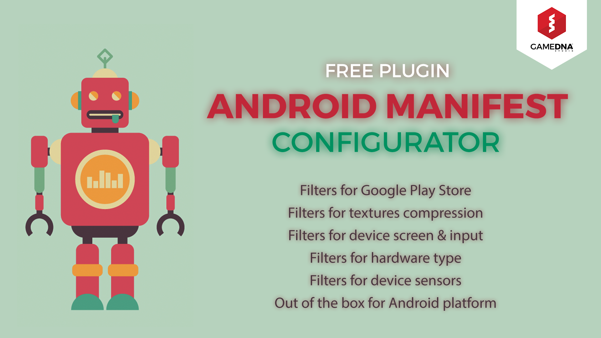
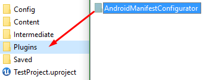
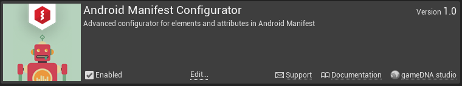
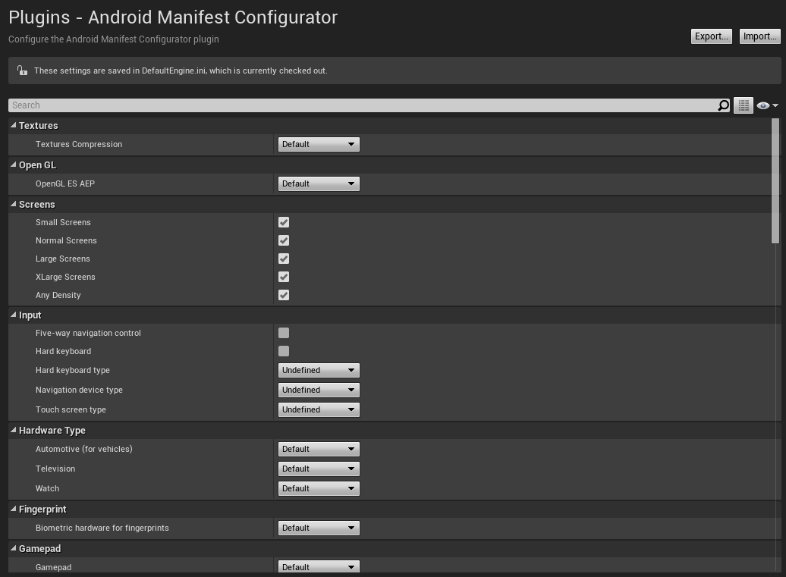

# Android Manifest Configurator

**Android Manifest Configurator** lets you configure AndroidManifest in an Unreal Engine 4 project using GUI in Project Settings. You can package separate versions for different configurations (smaller APK) and Google Play will automatically choose which one should be installed on a particular device. Plugin implements filters for texture compression, device screen & input, hardware type, device sensors, and more. More info about Filters on Google Play you can find on [official Android docs](https://developer.android.com/google/play/filters.html).

* **Current version:** 1.11.0
* **Binaries compiled for:** Unreal Engine 4.23
* **Required Unreal Engine 4.23 or above.**

## Features
* Filters for Google Play Store
* Filters for textures compression
* Filters for device screen & input
* Filters for hardware type
* Filters for device sensors
* Out of the box for Android platform

## Setup
Copy this folder to the *Plugins* folder located in the main path of your project.

Enable *Android Manifest Configurator* in *Edit -> Plugins -> Misc -> Android Manifest Configurator*.

Go to *Project Settings -> Plugins -> Android Manifest Configurator* and change properties as you want. More info about *Filters on Google Play* you can find on [official Android docs](https://developer.android.com/google/play/filters.html).

Plugin icon designed by _Freepik_.
